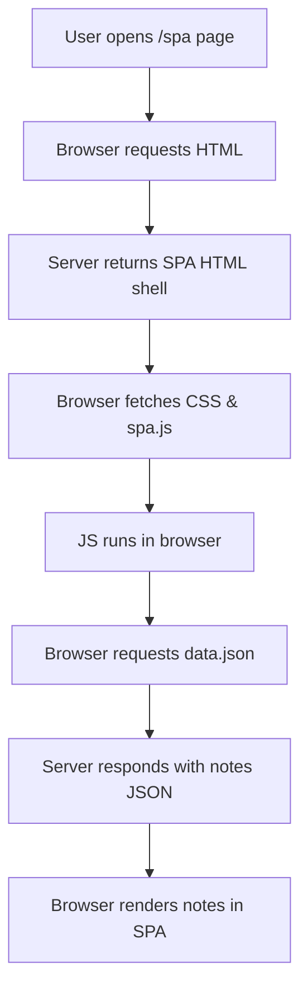

sequenceDiagram
  participant browser
  participant server

  Note over browser: User navigates to /exampleapp/spa

  browser->>server: GET https://studies.cs.helsinki.fi/exampleapp/spa
  activate server
  server-->>browser: HTML (SPA shell)
  deactivate server

  browser->>server: GET https://studies.cs.helsinki.fi/exampleapp/main.css
  activate server
  server-->>browser: main.css
  deactivate server

  browser->>server: GET https://studies.cs.helsinki.fi/exampleapp/spa.js
  activate server
  server-->>browser: spa.js
  deactivate server

  Note right of browser: spa.js runs, initializes app and fetches notes

  browser->>server: GET https://studies.cs.helsinki.fi/exampleapp/data.json
  activate server
  server-->>browser: JSON [ { "content": "...", "date": "..." }, ... ]
  deactivate server

  Note right of browser: JS renders notes in the SPA without page reloads

